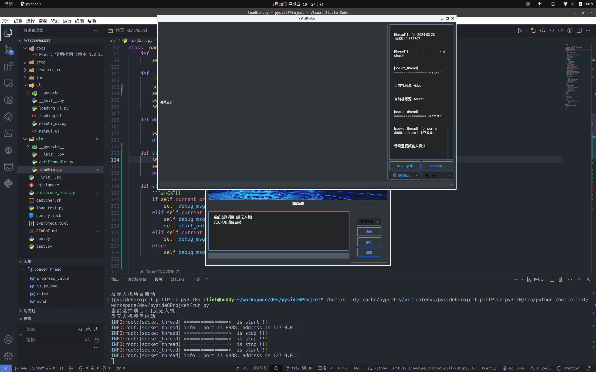

# 一个使用Pyside6正在开发的多线程上位机界面程序

## 1.安装poetry (依赖scoop、pipx)

> 1. 安装scoop
>
> ```powershell
> Set-ExecutionPolicy -ExecutionPolicy RemoteSigned -Scope CurrentUser
> Invoke-RestMethod -Uri https://get.scoop.sh | Invoke-Expression
> ```

>   2. 安装pipx
>
> ```powershell
> scoop install pipx
> pipx ensurepath
> ```

> 3. 安装poetry
>
> ```powershell
> pipx install poetry
> ```

---

## 2.poetry简单使用

[Poetry 使用指南](docs\Poetry 使用指南 (版本 1.8.2).md)

[Poetry 官网方文档](https://python-poetry.org/docs/#system-requirements)

```powershell
# 加载环境
poetry install --no-root
```
---
## 3.运行

> `win/loadWin.py` 为加载页面
>
> 运行: `python load_test.py`


> `win/mainWin.py` 为反无人机操作页面
>
> 运行：`python main_test.py`
>

---
## 4.待完成的任务
1. 使用`run.py` 启动 `win/loadWin.py`,然后通过`class loadWin`再开启`class mainWin`
2. `thr/socketThread.py`数据传输模块测试
3. 添加一个实时显示下位机云台状态的动画

--- 
## BUG日志

### Bug1 -- 2024.3.25
> `run.py` 希望作为系统启动入口
>
> 但目前还有bug，问题是：
>  - 主线程的子线程里，貌似不能再启动子线程【还未解决】
> 
```
# 报错1.
QObject::setParent: Cannot set parent, new parent is in a different thread
QBasicTimer::stop: Failed. Possibly trying to stop from a different thread
QBasicTimer::stop: Failed. Possibly trying to stop from a different thread
QBasicTimer::stop: Failed. Possibly trying to stop from a different thread
QBasicTimer::stop: Failed. Possibly trying to stop from a different thread
```
```
# 报错2 
Traceback (most recent call last):
  File "/home/clint/workspace/dev/pyside6Projcet/thr/mainWinThread.py", line 25, in run
    self.main.exec()
AttributeError: 'MainWin' object has no attribute 'exec'
QBasicTimer::start: Timers cannot be started from another thread
QObject::startTimer: Timers can only be used with threads started with QThread
QBasicTimer::start: Timers cannot be started from another thread
QObject::killTimer: Timers cannot be stopped from another thread
QBasicTimer::start: Timers cannot be started from another thread
```

#### 想到的解决思路 -- 2024.3.28
> 1. 放弃模块化的并行设计，只对特定耗时的任务上使用多线程 
>     - [实现快，可复用性差，可行性高]
> 2. 尝试Multiprocessing模块，使用进程管理
>     - [实现慢，可复用性高，可行性一般]
> 3. 使用stalkless版本的python ,利用协程来解决这个问题
>     - [专为并行而设计的Python版本，可以后期了解一下]

#### 尝试（方案一）：
> 只在主页面中写GUI，然后在子页面中启动线程，用于各种需要等待的耗时操作。

【2024.3.28 10：58：23】 此方案很可以，问题解决！


